# AWS Three‑Tier Web Application

A fully serverless, scalable, and globally distributed three‑tier web application built using Amazon S3, CloudFront, API Gateway, Lambda, and DynamoDB. This project demonstrates how modern cloud applications are architected using AWS native services.

---

## Project Overview

This project implements a complete **three‑tier architecture**:

- **Presentation Tier** – Static website hosted on S3 and delivered globally via CloudFront  
- **Logic Tier** – Serverless backend using AWS Lambda + API Gateway  
- **Data Tier** – NoSQL database using DynamoDB  

The goal of this project is to design, deploy, and connect all three layers into a functional cloud application that retrieves user data through a serverless API and displays it through a globally distributed front end.

---

## Architecture Overview and Workflow Diagrams

### Part 1: Presentation Tier

- Creating the S3 Bucket:  
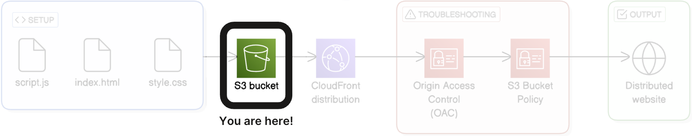

- Upload website files to the S3 Bucket:  
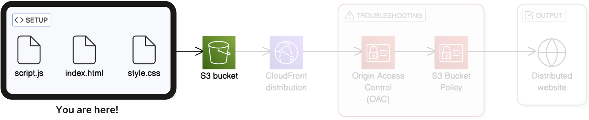

- Setting up CloudFront Distribution to host website:  
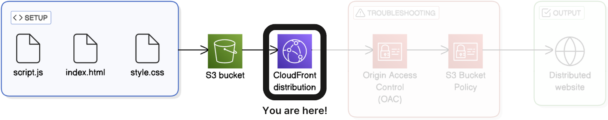

- Verifying Cloud Distribution is working:  
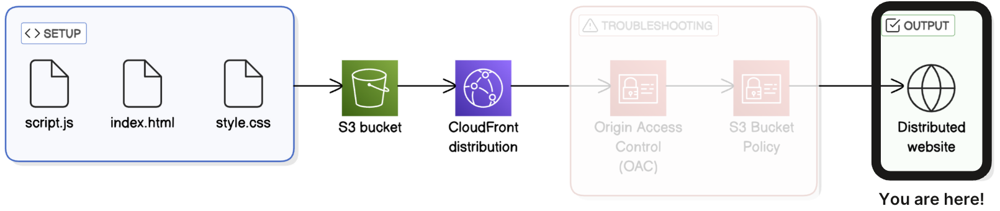

- Updating CloudFront Settings for permission access:  
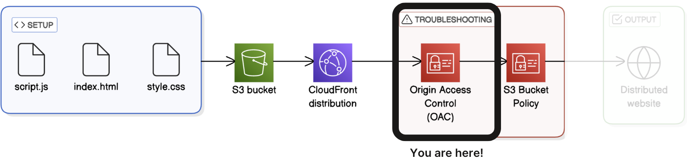

- Updating S3 Bucket permission settings:  
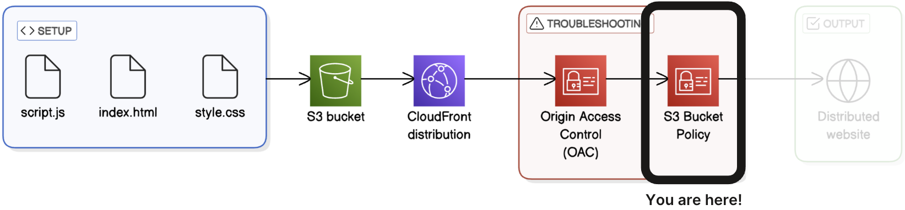

- Final Overview of Presentation Tier:  
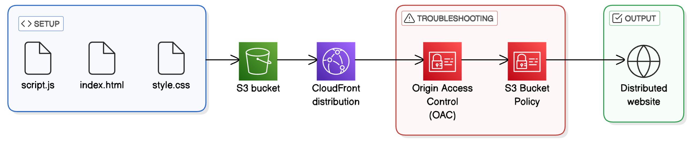

- Presentation Tier Completed:  
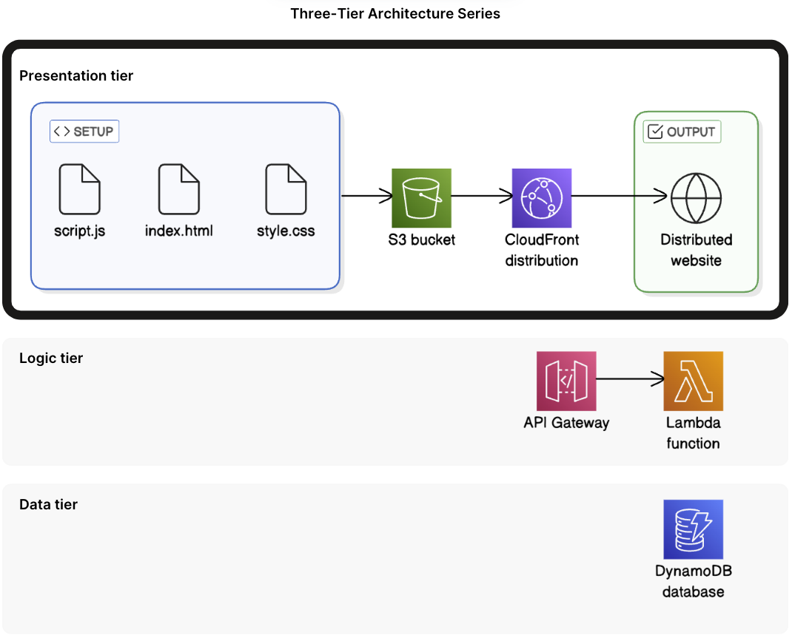

---

### Part 2: Logic Tier

- Creating the Lambda Function that will fetch data from the Database:  
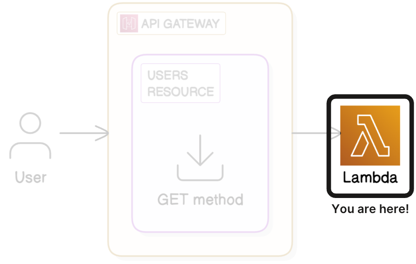

- Create a new API in API Gateway to carry requests to the Lambda Function:  
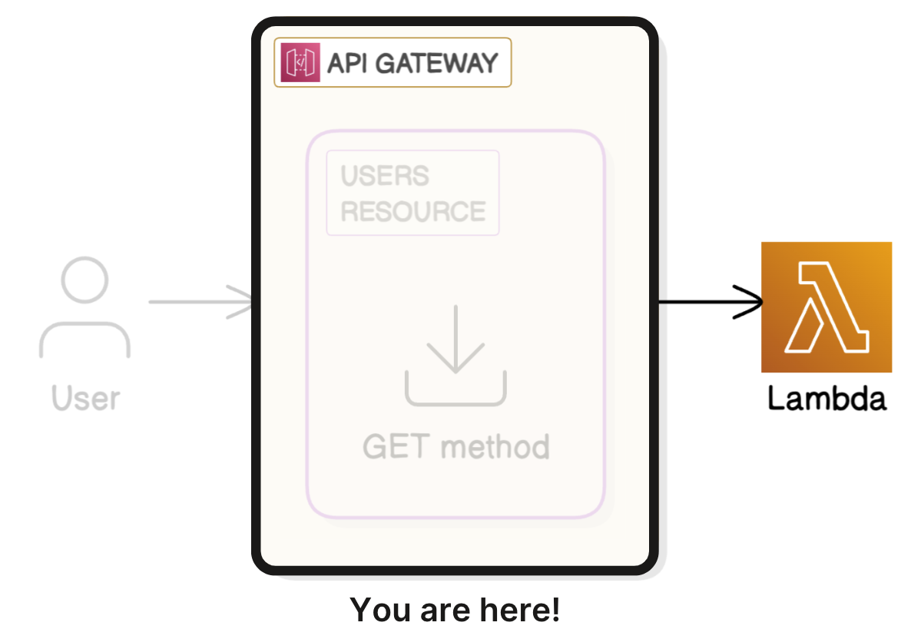

- Create API resource that will handle the API requests:  
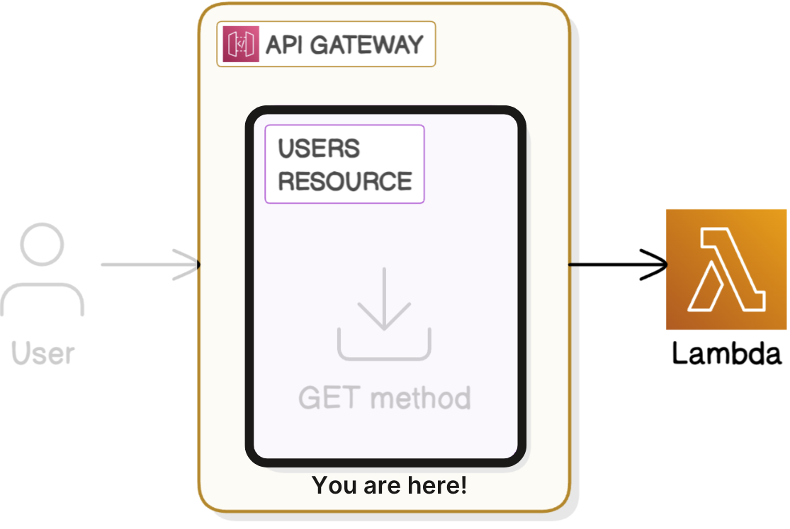

- Create the API method that allows things to be done with the resource:  
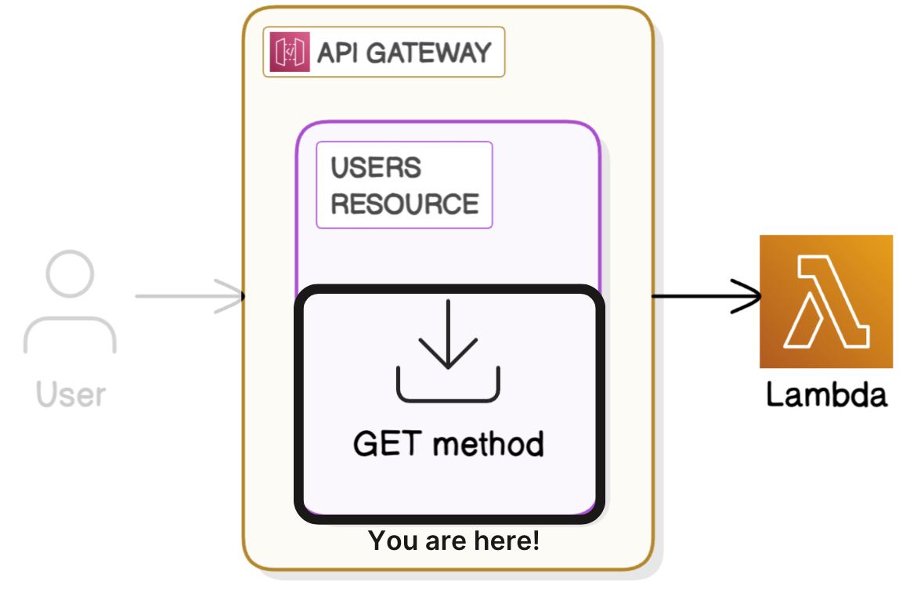

- Deploy API and make accessible through a public endpoint:  
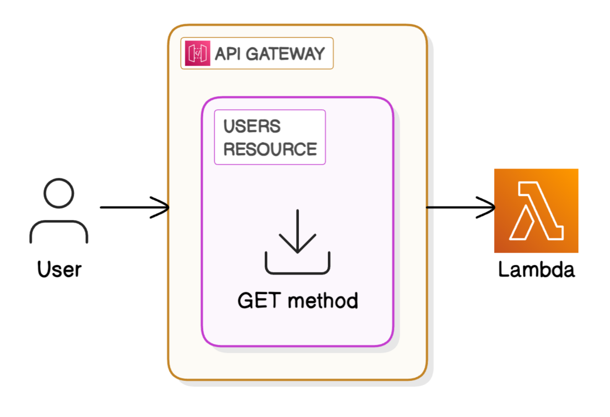

- Logic Tier Completed:  
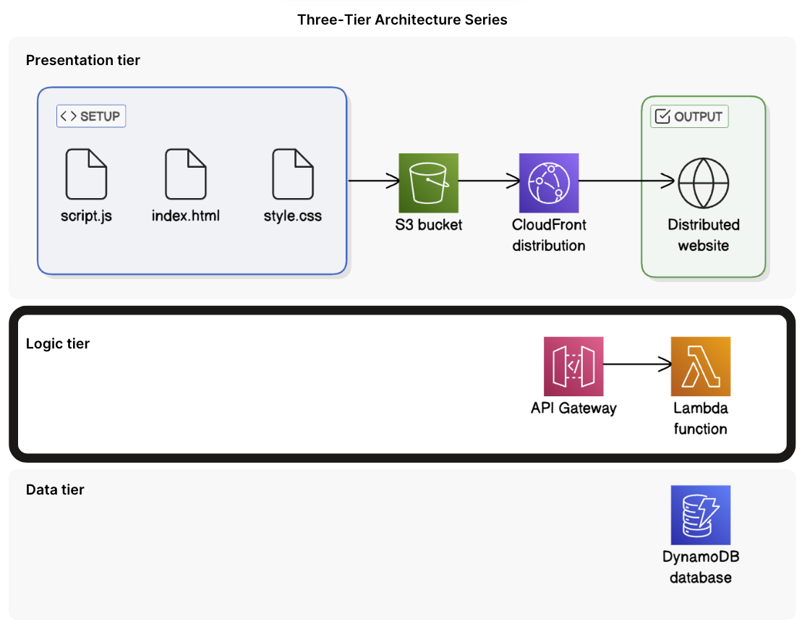

---

### Part 3: Data Tier

- Create DynamoDB table to store user data:  
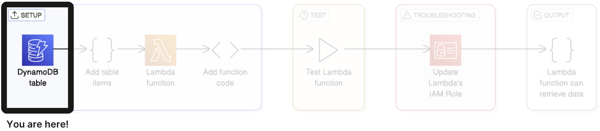

- Adding sample data to the DynamoDB table:  
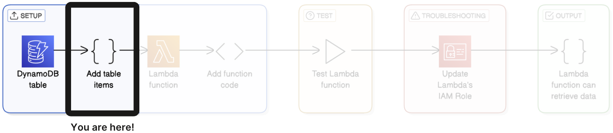

- Lambda function created like in Logic Tier:  
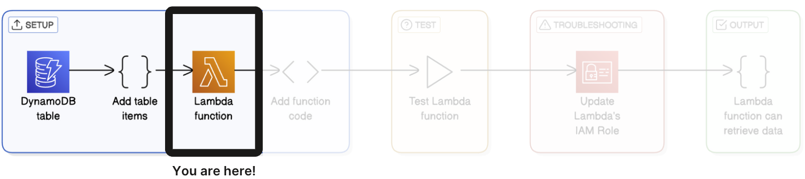

- Implementing Lambda Function Code like in Logic Tier:  
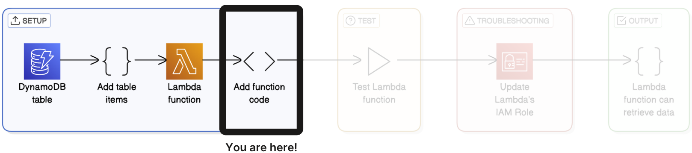

- Testing the Lambda Function with Lambda Function Test:  
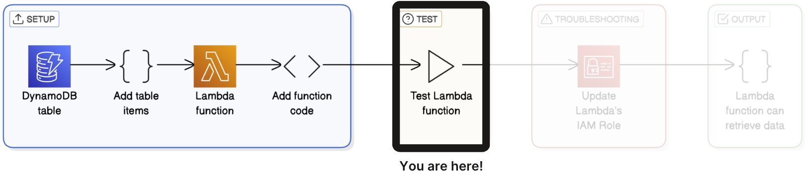

- Grant DynamoDB access to Lambda:  
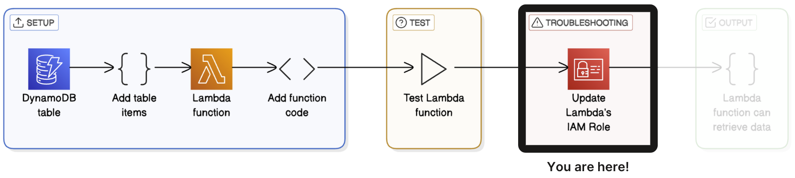

- Testing Lambda Function again after DB access:  
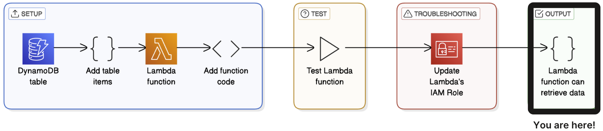

- Final Workflow of Data Tier:  
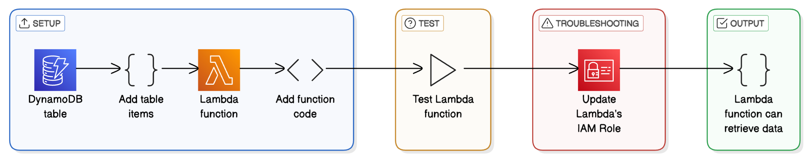

- Data Tier Completed:  
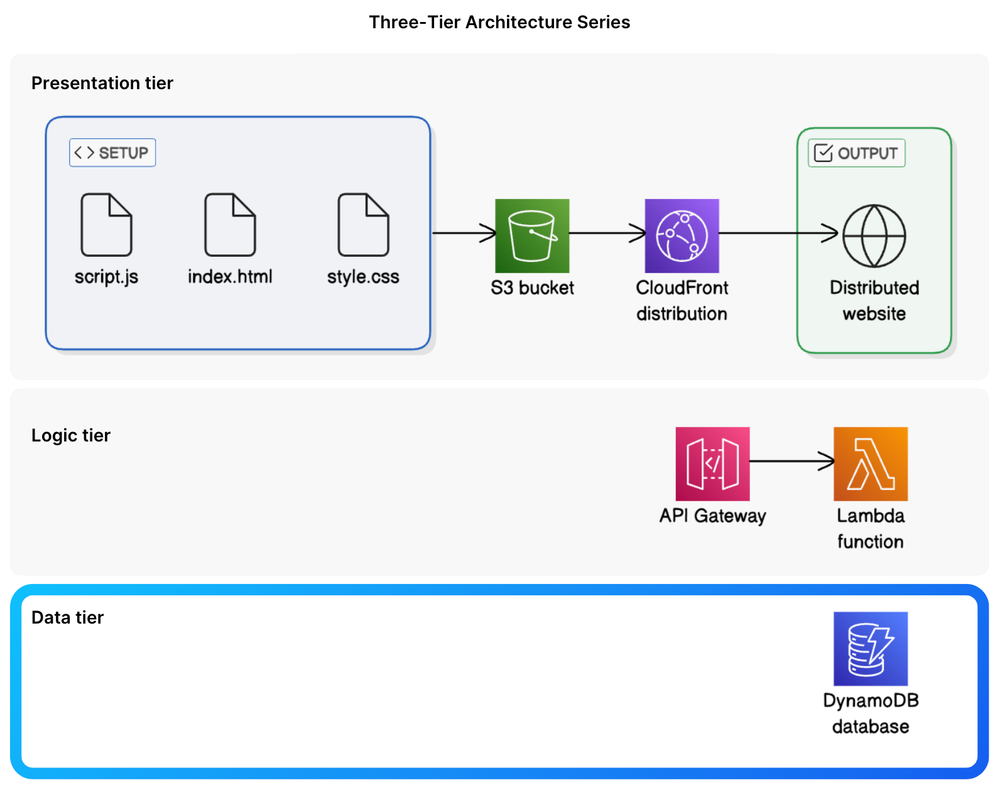

---