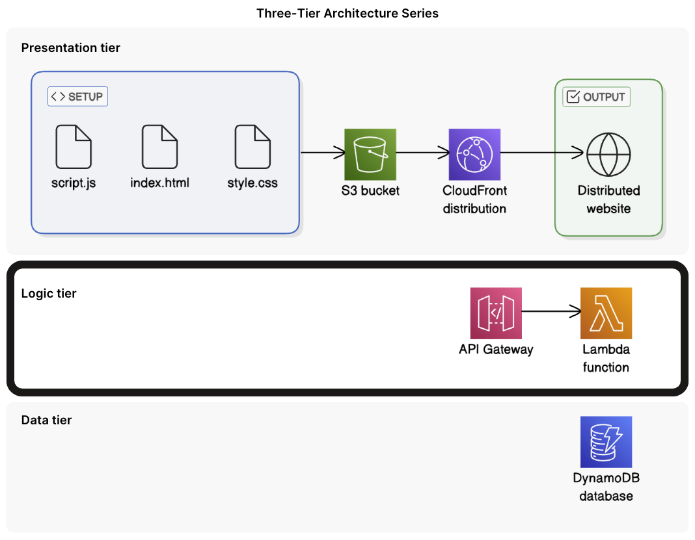
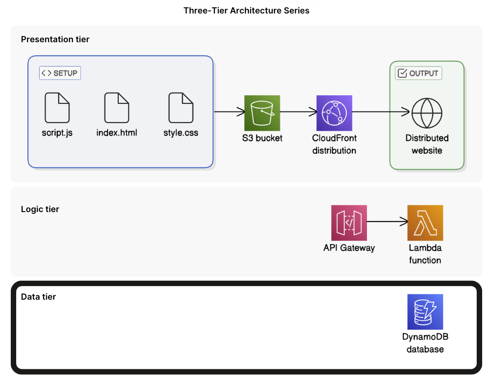
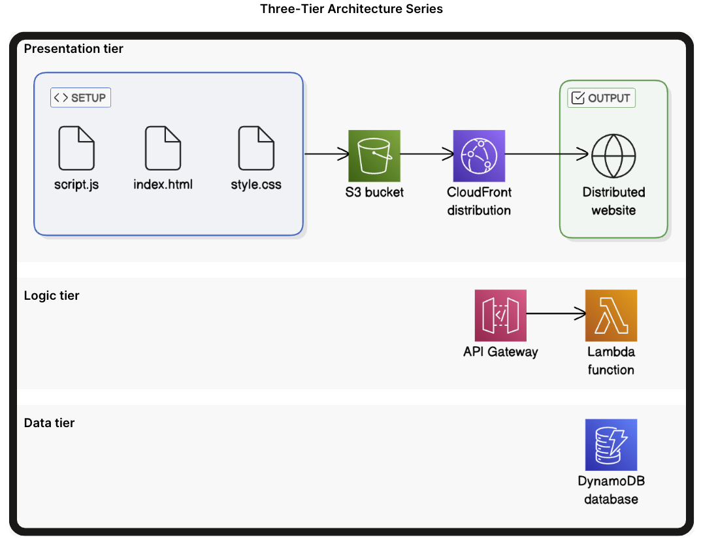

# AWS Three‑Tier Web Application

A fully serverless, scalable, and globally distributed three‑tier web application built using Amazon S3, CloudFront, API Gateway, Lambda, and DynamoDB. This project demonstrates how modern cloud applications are architected using AWS native services.

---

## Project Overview

This project implements a complete **three‑tier architecture**:

- **Presentation Tier** – Static website hosted on S3 and delivered globally via CloudFront  
- **Logic Tier** – Serverless backend using AWS Lambda + API Gateway  
- **Data Tier** – NoSQL database using DynamoDB  

The goal of this project is to design, deploy, and connect all three layers into a functional cloud application that retrieves user data through a serverless API and displays it through a globally distributed front end.

---

## Architecture Overview and Workflow Diagrams

### Part 1: Presentation Tier

- Creating the S3 Bucket:  

- Upload website files to the S3 Bucket:  

- Setting up CloudFront Distribution to host website:  

- Verifying Cloud Distribution is working:  

- Updating CloudFront Settings for permission access:  

- Updating S3 Bucket permission settings:  

- Final Overview of Presentation Tier:  

---

### Part 2: Logic Tier

- Creating the Lambda Function that will fetch data from the Database:  

- Create a new API in API Gateway to carry requests to the Lambda Function:  

- Create API resource that will handle the API requests:  

- Create the API method that allows things to be done with the resource:  

- Deploy API and make accessible through a public endpoint:  

---

### Part 3: Data Tier

- Create DynamoDB table to store user data:  

- Adding sample data to the DynamoDB table:  

- Lambda function created like in Logic Tier:  

- Implementing Lambda Function Code like in Logic Tier:  

- Testing the Lambda Function with Lambda Function Test:  

- Grant DynamoDB access to Lambda:  

- Testing Lambda Function again after DB access:  

- Final Workflow of Data Tier:  

---

### Part 4: Integrating all Tiers Together

- Presentation Tier Completed:  

- Logic Tier Completed:  

- Data Tier Completed:  

- Completed project architecture overivew  

---

## Tools & AWS Services Used

- **Amazon S3** — Static website hosting for the Presentation Tier  
- **Amazon CloudFront** — Global CDN for secure, low‑latency content delivery  
- **AWS Lambda** — Serverless compute for backend logic  
- **Amazon API Gateway** — REST API layer connecting frontend to backend  
- **Amazon DynamoDB** — NoSQL database for storing and retrieving user data  
- **AWS IAM** — Identity & Access Management for secure permissions  
- **Amazon CloudWatch** — Logging, monitoring, and debugging  
- **AWS SDK for JavaScript** — Used inside Lambda to query DynamoDB  
- **AWS Management Console** — Deployment, configuration, and testing of all services  

---

## What I Learned

Building this three‑tier serverless application strengthened my understanding of how modern cloud systems are designed, deployed, and connected. Key takeaways include:

- **Serverless Architecture Design** — Gained hands‑on experience structuring a fully serverless application using S3, CloudFront, API Gateway, Lambda, and DynamoDB.
- **Frontend–Backend Integration** — Learned how static websites securely communicate with backend APIs through CloudFront and API Gateway.
- **Lambda Development & Debugging** — Improved skills writing, testing, and troubleshooting Lambda functions, including handling permissions, environment variables, and AWS SDK calls.
- **IAM Permissions & Security** — Understood how IAM roles and policies control access between services (Lambda → DynamoDB, CloudFront → S3).
- **API Gateway Configuration** — Learned how to create resources, methods, integrations, and deployments to expose Lambda functions through public endpoints.
- **DynamoDB Access Patterns** — Practiced reading data from DynamoDB using the AWS SDK and structuring tables for fast, scalable lookups.
- **CloudFront Distribution Behavior** — Gained experience configuring caching, origins, and permissions to securely serve a global website.
- **End‑to‑End Testing** — Validated each tier independently and then tested the full workflow from CloudFront → API Gateway → Lambda → DynamoDB.

This project helped me understand how real cloud applications are built and how AWS services interact to create scalable, secure, and cost‑efficient architectures.
